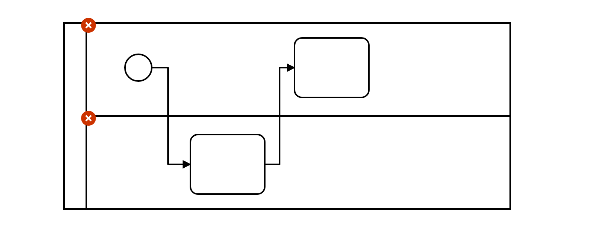
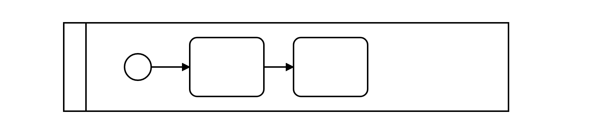

# Avoid Lanes (avoid-lanes)

Lanes have no execution semantics and thus are discouraged in executable processes.

Example of __incorrect__ usage for this rule:

Cf. [`avoid-lanes-incorrect.bpmn`](./examples/avoid-lanes-incorrect.bpmn).

Example of __correct__ usage for this rule:

Cf. [`avoid-lanes-correct.bpmn`](./examples/avoid-lanes-correct.bpmn).