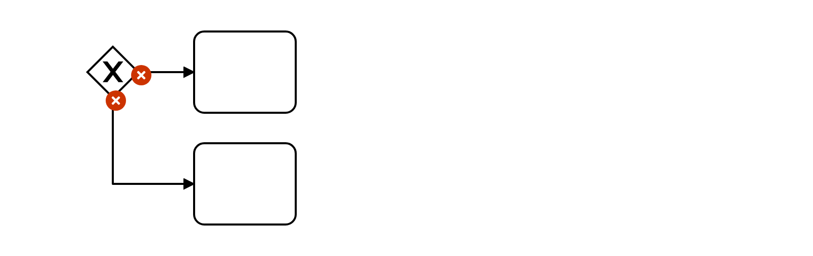
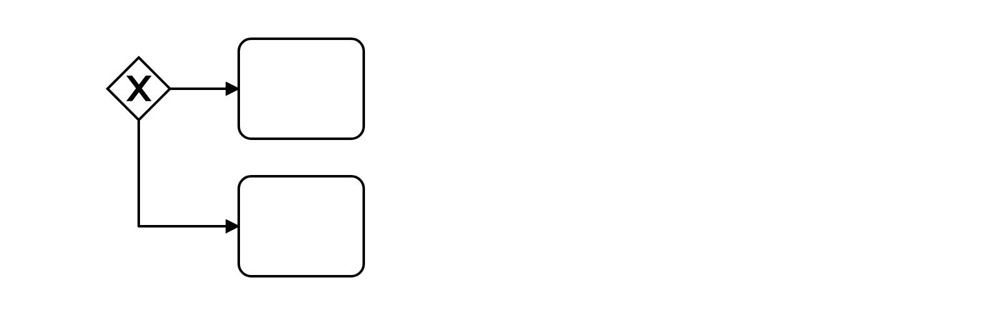

# Forking Conditions (forking-conditions)

This rule ensures that sequence flows have conditions attached when when the flow forks.

Example of __incorrect__ usage for this rule:

Cf. [`forking-conditions-incorrect.bpmn`](./examples/forking-conditions-incorrect.bpmn).

Example of __correct__ usage for this rule:

Cf. [`forking-conditions-correct.bpmn`](./examples/exclusive-gateway-conditions-correct.bpmn).